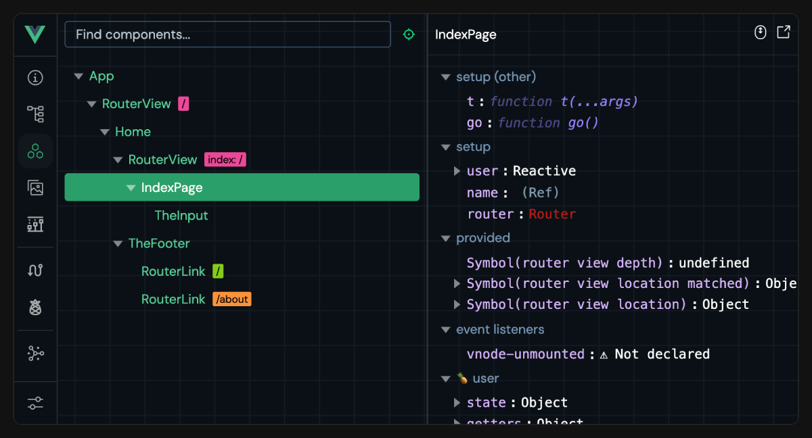

<script setup>
import { VTCodeGroup, VTCodeGroupTab } from '@vue/theme'
</script>

# 工具链 {#tooling}

## 在线试用 {#try-it-online}

你无需在本机安装任何东西就可以试用 Vue SFC —— 现在有一些在线沙盒可以让你直接在浏览器中完成这件事：

- [Vue SFC Playground](https://play.vuejs.org)
  - 始终从最新提交部署
  - 专为检查组件编译结果而设计
- [Vue + Vite on StackBlitz](https://vite.new/vue)
  - 在浏览器中运行真实 Vite 开发服务器的、类似 IDE 的环境
  - 最接近本地环境

当报告 bug 时，也建议使用这些在线沙盒来提供复现示例。

## 项目脚手架 {#project-scaffolding}

### Vite {#vite}

[Vite](https://vite.dev/) 是一个轻量且快速的构建工具，对 Vue SFC 提供一流支持。它由 Evan You 创建，他也是 Vue 的作者！

开始使用 Vite + Vue，只需运行：

::: code-group

```sh [npm]
$ npm create vue@latest
```

```sh [pnpm]
$ pnpm create vue@latest
```
  
```sh [yarn]
# 适用于 Yarn Modern（v2+）
$ yarn create vue@latest
  
# 适用于 Yarn ^v4.11
$ yarn dlx create-vue@latest
```
  
```sh [bun]
$ bun create vue@latest
```

:::

该命令会安装并执行 [create-vue](https://github.com/vuejs/create-vue)，这是官方的 Vue 项目脚手架工具。

- 想了解更多关于 Vite 的信息，请查看 [Vite 文档](https://vite.dev/)。
- 要在 Vite 项目中配置 Vue 相关行为，例如向 Vue 编译器传递选项，请查看 [@vitejs/plugin-vue](https://github.com/vitejs/vite-plugin-vue/tree/main/packages/plugin-vue#readme) 的文档。

上面提到的两个在线沙盒也都支持将文件下载为 Vite 项目。

### Vue CLI {#vue-cli}

[Vue CLI](https://cli.vuejs.org/) 是 Vue 官方基于 webpack 的工具链。它目前处于维护模式，除非你依赖某些仅有 webpack 才支持的特性，否则我们建议新项目使用 Vite。在大多数情况下，Vite 都会提供更优越的开发体验。

关于从 Vue CLI 迁移到 Vite 的信息：

- [来自 VueSchool.io 的 Vue CLI -> Vite 迁移指南](https://vueschool.io/articles/vuejs-tutorials/how-to-migrate-from-vue-cli-to-vite/)
- [帮助自动迁移的工具 / 插件](https://github.com/vitejs/awesome-vite#vue-cli)

### 浏览器内模板编译说明 {#note-on-in-browser-template-compilation}

当不使用构建步骤时，组件模板要么直接写在页面的 HTML 中，要么写成内联的 JavaScript 字符串。在这种情况下，Vue 需要向浏览器发送模板编译器，以便进行即时模板编译。另一方面，如果我们使用构建步骤预编译模板，那么编译器就是不必要的。为了减小客户端包体积，Vue 提供了[针对不同使用场景优化的不同“构建版本”](https://unpkg.com/browse/vue@3/dist/)。

- 以 `vue.runtime.*` 开头的构建文件是**仅运行时构建**：它们不包含编译器。使用这些构建时，所有模板都必须通过构建步骤预先编译。

- 不包含 `.runtime` 的构建文件是**完整构建**：它们包含编译器，并支持直接在浏览器中编译模板。不过，这会使负载增加约 14kb。

我们的默认工具链配置使用仅运行时构建，因为 SFC 中的所有模板都会被预编译。若因某些原因，即使使用了构建步骤，你仍然需要在浏览器内编译模板，也可以通过将构建工具配置为把 `vue` 别名指向 `vue/dist/vue.esm-bundler.js` 来实现。

如果你在寻找一种无需构建步骤、同时更轻量的替代方案，可以看看 [petite-vue](https://github.com/vuejs/petite-vue)。

## IDE 支持 {#ide-support}

- 推荐的 IDE 配置是 [VS Code](https://code.visualstudio.com/) + [Vue - Official 扩展](https://marketplace.visualstudio.com/items?itemName=Vue.volar)（之前叫 Volar）。该扩展提供语法高亮、TypeScript 支持，以及模板表达式和组件 props 的智能提示。

  :::tip
  Vue - Official 取代了 [Vetur](https://marketplace.visualstudio.com/items?itemName=octref.vetur)，这是我们之前为 Vue 2 提供的官方 VS Code 扩展。如果你当前安装了 Vetur，请务必在 Vue 3 项目中将其禁用。
  :::

- [WebStorm](https://www.jetbrains.com/webstorm/) 也为 Vue SFC 提供了很好的内置支持。

- 其他支持 [语言服务协议](https://microsoft.github.io/language-server-protocol/)（LSP）的 IDE，也可以通过 LSP 利用 Volar 的核心功能：

  - 通过 [LSP-Volar](https://github.com/sublimelsp/LSP-volar) 支持 Sublime Text。

  - 通过 [coc-volar](https://github.com/yaegassy/coc-volar) 支持 vim / Neovim。

  - 通过 [lsp-mode](https://emacs-lsp.github.io/lsp-mode/page/lsp-volar/) 支持 emacs

## 浏览器开发者工具 {#browser-devtools}

Vue 浏览器开发者工具扩展可以让你探索 Vue 应用的组件树、检查各个组件的状态、跟踪状态管理事件，以及分析性能。



- [文档](https://devtools.vuejs.org/)
- [Chrome 扩展](https://chromewebstore.google.com/detail/vuejs-devtools/nhdogjmejiglipccpnnnanhbledajbpd)
- [Vite 插件](https://devtools.vuejs.org/guide/vite-plugin)
- [独立 Electron 应用](https://devtools.vuejs.org/guide/standalone)

## TypeScript {#typescript}

主文档：[在 Vue 中使用 TypeScript](/guide/typescript/overview)。

- [Vue - Official 扩展](https://github.com/vuejs/language-tools) 支持使用 `<script lang="ts">` 块对 SFC 进行类型检查，包括模板表达式和跨组件 props 校验。

- 使用 [`vue-tsc`](https://github.com/vuejs/language-tools/tree/master/packages/tsc) 可通过命令行执行相同的类型检查，或为 SFC 生成 `d.ts` 文件。

## 测试 {#testing}

主文档：[测试指南](/guide/scaling-up/testing)。

- E2E 测试推荐使用 [Cypress](https://www.cypress.io/)。它也可以通过 [Cypress 组件测试运行器](https://docs.cypress.io/guides/component-testing/introduction) 用于 Vue SFC 的组件测试。

- [Vitest](https://vitest.dev/) 是由 Vue / Vite 团队成员创建的测试运行器，专注于速度。它专为基于 Vite 的应用设计，为单元 / 组件测试提供同样即时的反馈循环。

- [Jest](https://jestjs.io/) 可以通过 [vite-jest](https://github.com/sodatea/vite-jest) 与 Vite 配合使用。不过，只有在你已有基于 Jest 的测试套件需要迁移到基于 Vite 的配置时才建议这样做，因为 Vitest 提供了类似的功能，而且集成效率高得多。

## 代码检查 {#linting}

Vue 团队维护着 [eslint-plugin-vue](https://github.com/vuejs/eslint-plugin-vue)，这是一个支持 SFC 特定 lint 规则的 [ESLint](https://eslint.org/) 插件。

之前使用 Vue CLI 的用户可能习惯于通过 webpack loader 配置代码检查器。不过，在使用基于 Vite 的构建配置时，我们的一般建议是：

1. `npm install -D eslint eslint-plugin-vue`，然后按照 `eslint-plugin-vue` 的[配置指南](https://eslint.vuejs.org/user-guide/#usage)进行设置。

2. 配置 ESLint 的 IDE 扩展，例如 [VS Code 的 ESLint 扩展](https://marketplace.visualstudio.com/items?itemName=dbaeumer.vscode-eslint)，这样你就能在开发时直接在编辑器中获得代码检查反馈。这也能避免在启动开发服务器时产生不必要的代码检查开销。

3. 在生产构建命令中运行 ESLint，这样在发布到生产环境前你就能获得完整的代码检查反馈。

4. （可选）配置 [lint-staged](https://github.com/okonet/lint-staged) 等工具，以便在 git 提交时自动检查被修改的文件。

## 格式化 {#formatting}

- [Vue - Official](https://github.com/vuejs/language-tools) VS Code 扩展开箱即提供 Vue SFC 的格式化支持。

- 或者，[Prettier](https://prettier.io/) 也内置了对 Vue SFC 的格式化支持。

## SFC 自定义块集成 {#sfc-custom-block-integrations}

自定义块会被编译成对同一个 Vue 文件的导入，只是请求查询参数不同。如何处理这些导入请求取决于底层构建工具。

- 如果使用 Vite，应使用自定义 Vite 插件将匹配到的自定义块转换为可执行的 JavaScript。[示例](https://github.com/vitejs/vite-plugin-vue/tree/main/packages/plugin-vue#example-for-transforming-custom-blocks)

- 如果使用 Vue CLI 或原生 webpack，则应配置 webpack loader 来转换匹配到的块。[示例](https://vue-loader.vuejs.org/guide/custom-blocks.html)

## 底层包 {#lower-level-packages}

### `@vue/compiler-sfc` {#vue-compiler-sfc}

- [文档](https://github.com/vuejs/core/tree/main/packages/compiler-sfc)

该包是 Vue 核心 monorepo 的一部分，并且始终与主 `vue` 包以相同版本发布。它作为主 `vue` 包的依赖被包含，并通过 `vue/compiler-sfc` 代理导出，因此你无需单独安装它。

该包本身提供了处理 Vue SFC 的底层工具，主要面向那些需要在自定义工具中支持 Vue SFC 的工具作者。

:::tip
始终优先通过 `vue/compiler-sfc` 深度导入来使用该包，因为这可以确保其版本与 Vue 运行时保持同步。
:::

### `@vitejs/plugin-vue` {#vitejs-plugin-vue}

- [文档](https://github.com/vitejs/vite-plugin-vue/tree/main/packages/plugin-vue)

为 Vite 提供 Vue SFC 支持的官方插件。

### `vue-loader` {#vue-loader}

- [文档](https://vue-loader.vuejs.org/)

为 webpack 提供 Vue SFC 支持的官方 loader。如果你正在使用 Vue CLI，也请参阅 [在 Vue CLI 中修改 `vue-loader` 选项的文档](https://cli.vuejs.org/guide/webpack.html#modifying-options-of-a-loader)。

## 其他在线沙盒 {#other-online-playgrounds}

- [VueUse Playground](https://play.vueuse.org)
- [Repl.it 上的 Vue + Vite](https://replit.com/@templates/VueJS-with-Vite)
- [CodeSandbox 上的 Vue](https://codesandbox.io/p/devbox/github/codesandbox/sandbox-templates/tree/main/vue-vite)
- [Codepen 上的 Vue](https://codepen.io/pen/editor/vue)
- [WebComponents.dev 上的 Vue](https://webcomponents.dev/create/cevue)

<!-- TODO ## 后端框架集成 -->
